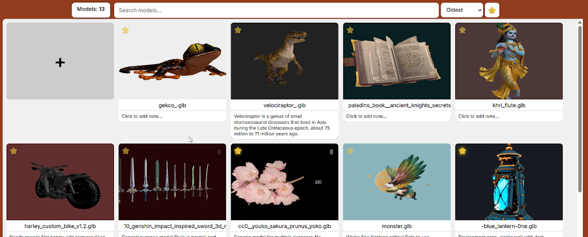

# 3D-Model-Gallery-Web-Application-
full-stack web app with in-browser 3D model viewing using Three.js Containerized with Docker Compose for simple setup and deployment
There are only 3 3D models in the “models” folder because they take up quite a bit of space on their own, and I didn't want to increase the project size just because of the model files.

Models are added to the gallery only by clicking the “plus” icon in the interface; do not add them manually to the folder, because the file data is saved to the database only when you click the “plus” icon.

