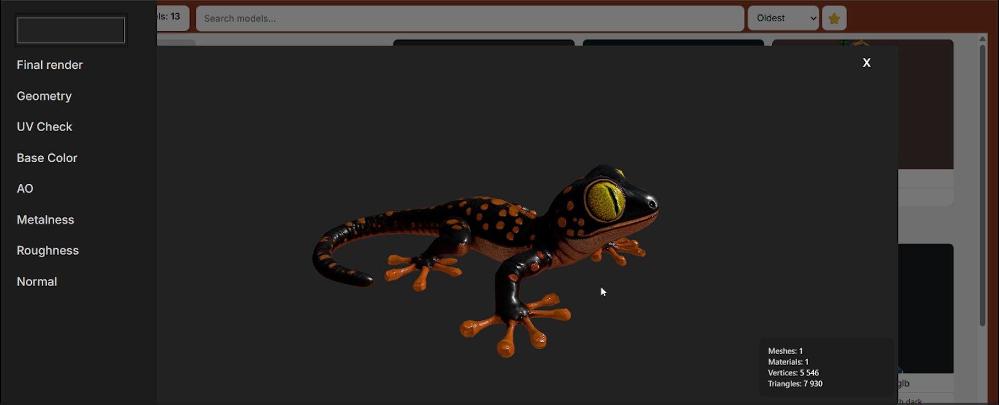

# 3D-Model-Gallery-Web-Application-
full-stack web app with in-browser 3D model viewing using Three.js Containerized with Docker Compose for simple setup and deployment
There are only 3 3D models in the “models” folder because they take up quite a bit of space on their own, and I didn't want to increase the project size just because of the model files.

Models are added to the gallery only by clicking the “plus” icon in the interface; do not add them manually to the folder, because the file data is saved to the database only when you click the “plus” icon.

Viewer
Rotation and Lighting
If you click on “Model Preview,” a view of the selected model will open.
In the model view, you can:
rotate the object with the mouse, change the light direction using the Ctrl + right-click combination.
Technical Information
The information panel displays:
   number of meshes,
   number of materials,
   number of vertices,
   number of triangles.
This gives the user a quick overview of the model’s complexity.
Changing the Background Color
You can change the scene’s background color. The selected color is saved locally and retained after the page is refreshed.

Preview Modes
Base Color
Displays a pure color map without the influence of light.
Normal Map
Shows fine surface details, such as bumps and indentations, without increasing the number of polygons.
AO (Ambient Occlusion)
Highlights areas where light is weaker, enhancing the sense of depth.
Roughness
Shows the degree of surface roughness.
Metalness
Shows which parts of the model behave like metal.
UV Check
Displays a test texture to verify the correctness of UV mapping.
Geometry
Displays only the polygon mesh.
Final Render
Restores the standard view with full lighting and all maps.

